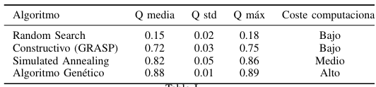

# Community Detection using Metaheuristics


Comparative study of heuristic and metaheuristic algorithms for community detection in graphs.

---

## 🧠 Overview

This project addresses the Community Detection Problem (CDP) on a co-authorship graph.

The objective is to partition nodes into communities maximizing modularity (Q).

---

## ⚙️ Problem

- Nodes → authors  
- Edges → collaborations  
- Goal → maximize modularity  

Due to the combinatorial nature of the problem, heuristic and metaheuristic methods are used.

---

## 🔬 Approaches

### 🔹 Random Search
Baseline method using random partitions.

---

### 🔹 GRASP
Constructive algorithm with controlled randomness.

---

### 🔹 Simulated Annealing
Local search with probabilistic acceptance of worse solutions.

---

### 🔹 Genetic Algorithm
Population-based optimization using crossover and mutation.

---

## 📊 Results

| Algorithm            | Modularity (Q) | Cost |
|----------------------|---------------|------|
| Random Search        | ~0.18         | Low  |
| GRASP                | ~0.75         | Low  |
| Simulated Annealing  | ~0.86         | Medium |
| Genetic Algorithm    | **~0.89**     | High |

---

## 🔍 Key Insights

- Random search is ineffective for structured problems  
- GRASP provides strong results with low cost  
- Simulated Annealing improves solutions via exploration  
- Genetic algorithms achieve best performance but at higher cost  

---

## 📁 Project Structure
notebooks/
data/sample/
results/
report/


---

## ▶️ How to Run

```bash
pip install -r requirements.txt
jupyter notebook notebooks/cdp_experiments.ipynb

📄 Report
Detailed analysis available in:
report/

🧠 Key Takeaway
There is no universally optimal algorithm; performance depends on the trade-off between solution quality and computational cost.
